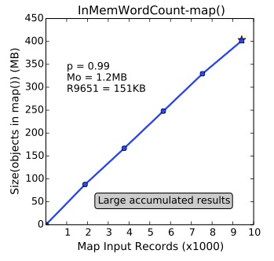

# DiagOOM 

Dataflow-centric memory analysis for *diagnosing the causes of OOM errors in MapReduce jobs*

## Requriements
- [Our enhanced Hadoop-1.2.0](https://github.com/JerryLead/hadoop-1.2.0-enhanced),  which supports generating heap dump at the *i*-th <k, v> record or <k, list(v)> group.
- [Our enhanced Eclipse MAT](https://github.com/JerryLead/enhanced-Eclipse-MAT), which supports extracting user objects and framework objects from the heap dump of map/reduce task.

## Usage
1. Run Hadoop jobs.
2. When OOM occurs in a job, please record the **job id** and failed **task id**.
3. Run `profile.profiler.SingleJobProfiler.main()` to collect the logs, dataflow counters, and JVM heap usage.
4. If the error doesn't occur in the user code, go to 7.
5. Run `dataflow.model.job.JobDataflowModelBuilder.main()` to get additional dump configurations.
6. Rerun the job with the configurations.
7. Collect the  the heap dumps from the cluster.
8. Run our `enhanced Eclipse MAT` to get the 'Framework objects@OOM' and  'User objects@record(i)'
9. Run `object.model.job.DumpedObjectsAnalyzer.OOMAnalyzer.main()` to get the diagnosis report.

## Results

The following items list the results of error diagnosis on [InMemWordCount](http://puffsun.iteye.com/blog/1902837).


### 1. Memory-consuming objects 

(a) Framework Objects:

| Framework object | Object type	| RetainedHeap 	|
| :----------- | :----------- | -----------: | -----------: |
| kvbuffer (map buffer)	| byte[398458880] @ 0xc1800000 | 398,458,896 B	|

 (b) User Objects:

| User object |  Object type | RetainedHeap | Length | Referenced thread | code() |
|:------------|  -------------:| -------------:| ------:|:------------ | ----------:| :------ | :------|
| wordCounter | java.util.HashMap @ 0xdbc5e0c0 | 430,875,440 B | 1,017,646 | main | map() |

### 2. Memory-consuming code snippets

User object (java.util.HashMap @ 0xdbc5e0c0) is referenced by

	|------ in map() in main ------|
	at java.util.HashMap.put(Ljava/lang/Object;Ljava/lang/Object;)Ljava/lang/Object; (HashMap.java:372)
		java.util.HashMap @ 0xdbc5e0c0 [285578]
		
	at mapper.WordCountOOM$InputDocumentsTokenizerMapper.map(Ljava/lang/Object;Lorg/apache/hadoop/io/Text;Lorg/apache/hadoop/mapreduce/Mapper$Context;)V (WordCountOOM.java:49)
		mapper.WordCountOOM$InputDocumentsTokenizerMapper @ 0xdbc2fda0 [281204]
		java.util.HashMap @ 0xdbc5e0c0 [285578]


The corresponding code snippet is labeled with "==>":

```java
public static class InputDocumentsTokenizerMapper extends
		Mapper<Object, Text, Text, IntWritable> {

	private Map<String, Integer> wordCounter;
	private final Text wordText = new Text();
	private final IntWritable totalCountInDocument = new IntWritable();

	@Override
	public void setup(Context context) throws IOException,
			InterruptedException {
		super.setup(context);

		wordCounter = new HashMap<String, Integer>();
	}

	@Override
	public void map(Object key, Text value, Context context)
			throws IOException, InterruptedException {

		StringTokenizer st = new StringTokenizer(value.toString());
		// Count every word in a document
		while (st.hasMoreTokens()) {
			String word = st.nextToken();
			if (wordCounter.containsKey(word)) {
				wordCounter.put(word, wordCounter.get(word) + 1);
			} else {
				wordCounter.put(word, 1); ==> wordCounter (java.util.HashMap @ 0xdbc5e0c0)
			}
		}
	}

	@Override
	public void cleanup(Context context) throws IOException,
			InterruptedException {

		// Emit each word as well as its count
		for (Map.Entry<String, Integer> entry : wordCounter.entrySet()) {
			wordText.set(entry.getKey());
			totalCountInDocument.set(entry.getValue());
			context.write(wordText, totalCountInDocument);
		}
		super.cleanup(context);
	}
}
```
### 3. Root cause in user code and error-related data

Quantified relationship between user objects and input data in *map*():



Symptoms => Causes:
 - PearsonCorrelation = 0.99 => Linear memory growth in [R1, R9651) => **Large map-level accumulated results** (i.e., wordCounter accmulates too many \<word, count\>s) => **Error-related data is [R1, R9651)** (i.e., all the input records of *map*())
 - Mo = 1.2 MB => No sharp growth at R9651 => There is not large record-level intermediate restuls
 - R9651 = 151KB => No large single record


### 4. Improper job configurations

Error-relaed data => Improper configurations:

All the input records of *map*() => **Large input split size** (here, it is 512MB)

### 5. Fix suggestions

- Lower the *input split size*
- Avoid accmulative operation on all the input records of map()


